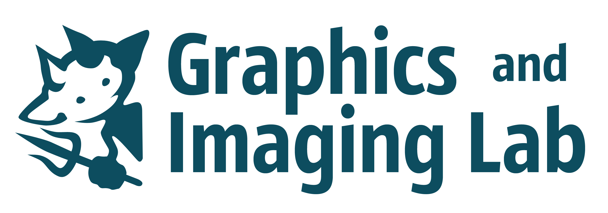

##  ASELSAN
#### Nov 2021 - Apr 2022
#### Candidate Research Engineer
Development of reinforcement learning algorithms.

##  Bilkent University
#### Jun 2021 - Sep 2021
#### Reseach Intern
Worked on Material Point Method solvers under the supervision of <a href="http://www.cs.bilkent.edu.tr/~gudukbay/">Dr. Uğur Güdükbay</a>

##  Graphics and Imaging Lab
#### Jun 2021 - Sep 2021
#### Research Intern
Worked on Non-Line of Sight Imaging and reconstruction with backprojection under the supervision of <a href="http://webdiis.unizar.es/~juliom/">Dr. Julio Marco</a>

##  Bilkent University
#### July 2020 - Oct 2020
#### Research Intern
Worked on Age of Information and queue networks under the supervision of <a href="http://www.ee.bilkent.edu.tr/~akar/">Dr. Nail Akar</a>

##  AYDUO Elektronik
#### Aug 2019 - Sep 2019
#### Digital Design Intern
Development of Gbit/s speed FPGA-PC Ethernet interface 
