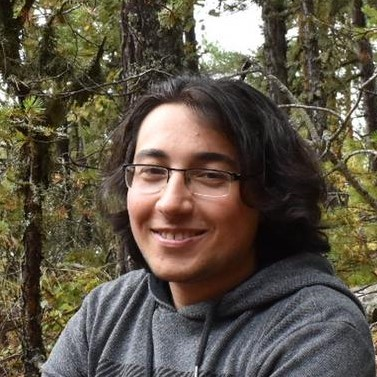

    

Welcome to my page, this is where I showcase my art, research and some thoughts and processes about everything. I am a computer graphics researcher, currently a PhD studet at Texas A&M University working with  <a href="http://people.tamu.edu/~ergun/">Dr. Ergun Akleman</a> on weaving structures, ray tracing and volumetric decompositions. 

[gh-site]: https://pages.github.com/
[minima]: https://github.com/jekyll/minima/tree/2.5-stable
[jk]: https://jekyllrb.com/
[gh]: https://help.github.com/en/github/working-with-github-pages`