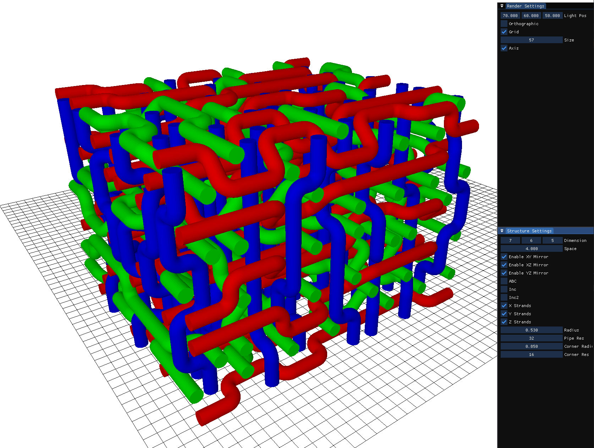
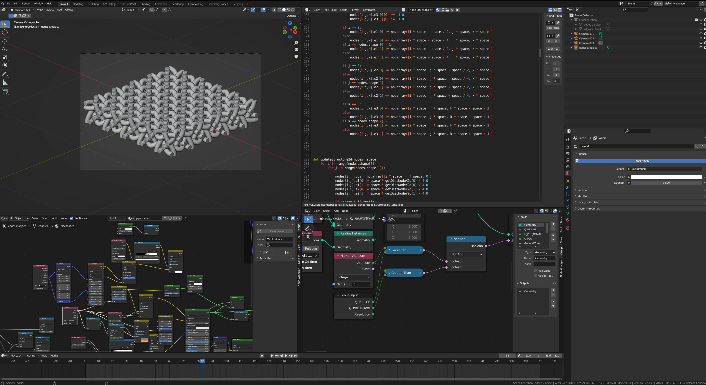
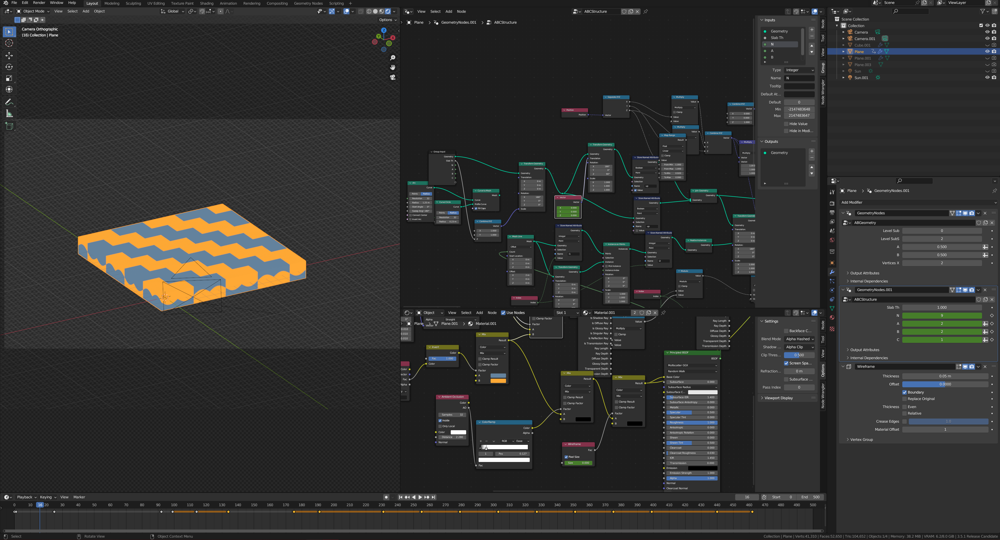
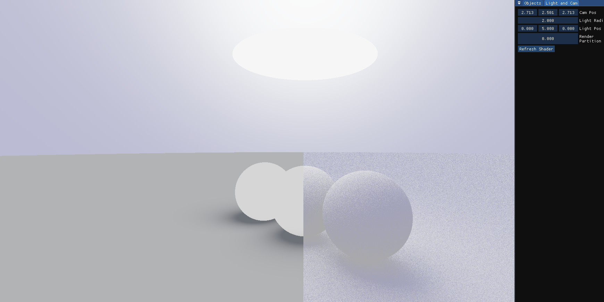

## 3D Weaving Generator in C++

With this project you can generate 3D weavings and visualize them in different configurations. For shading a simple OpenGL backend has been implemented. <a href="https://github.com/ComicAddict/GS3DCurves"> Github Repository</a> for the interested.

---
## 3D Weaving Generator using Blender API for Python

With this project you can generate 3D weaving directly inside blender. <a href="https://github.com/ComicAddict/gs3d_blender"> Github Repository</a> for the interested.

---

## Congruent Tile Generator in Blender

Using Geometry Nodes inside Blender you can generate building blocks for you models.

---

## Soft shadow approximator in C++

Using continuous functions generated by sampling to approximate global illumination